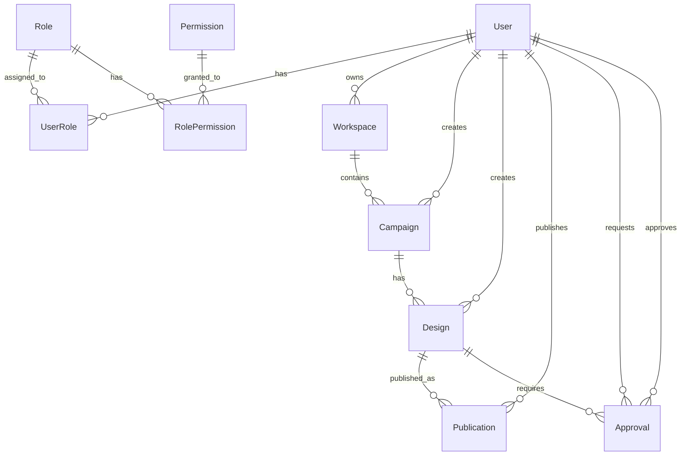

# Project Architecture

## Overview

This NestJS project follows a modular architecture designed for easy microservice extraction. Each module is self-contained and follows SOLID principles.

## Module Structure

### 1. Shared Module (`src/shared/`)
Contains common utilities, interfaces, DTOs, and exceptions used across all modules.

**Structure:**
```
shared/
├── interfaces/          # Common interfaces
├── dto/                # Base DTOs
├── exceptions/         # Custom exceptions
├── constants/          # Application constants
└── shared.module.ts    # Global shared module
```

### 2. Authentication Module (`src/modules/authentication/`)
Handles user authentication, registration, and JWT token management.

**Features:**
- User registration and login
- JWT token generation and refresh
- Password hashing with bcrypt
- User profile management

**Structure:**
```
authentication/
├── controllers/        # Auth endpoints
├── services/          # Business logic
├── repositories/      # Data access layer
├── entities/          # User entity
├── dto/              # Request/response DTOs
├── interfaces/       # Service contracts
└── authentication.module.ts
```

### 3. RBAC Module (`src/modules/rbac/`)
Role-Based Access Control system for managing permissions.

**Features:**
- Role management
- Permission management
- User-role assignments
- Permission-based access control

**Entities:**
- `Role`: User roles (admin, editor, viewer, etc.)
- `Permission`: Granular permissions (create, read, update, delete)
- `UserRole`: Many-to-many relationship between users and roles

### 4. Workspaces Module (`src/modules/workspaces/`)
Manages organizational workspaces for team collaboration.

**Features:**
- Workspace creation and management
- User workspace assignments
- Workspace-level permissions

### 5. Campaigns Module (`src/modules/campaigns/`)
Handles marketing campaign management.

**Features:**
- Campaign creation and lifecycle management
- Campaign status tracking (draft, active, paused, completed)
- Date-based campaign scheduling

### 6. Designer Module (`src/modules/designer/`)
Manages design creation and editing.

**Features:**
- Design creation and editing
- Design status management (draft, in_review, approved, rejected)
- Design data storage (JSON format)
- Preview and thumbnail management

### 7. Publisher Module (`src/modules/publisher/`)
Handles content publishing to external platforms.

**Features:**
- Publication scheduling
- Multi-platform publishing
- Publication status tracking
- External platform integration

### 8. Approval Workflow Module (`src/modules/approval-workflow/`)
Manages approval processes for designs and campaigns.

**Features:**
- Approval request creation
- Approval status tracking
- Comments and rejection reasons
- Multi-level approval workflows

## Database Design

### Entity Relationships



## SOLID Principles Implementation

### Single Responsibility Principle (SRP)
- Each module has a single, well-defined responsibility
- Services handle only business logic
- Repositories handle only data access
- Controllers handle only HTTP requests/responses

### Open/Closed Principle (OCP)
- Modules are open for extension but closed for modification
- New features can be added through new modules or extending existing ones
- Interfaces allow for easy implementation swapping

### Liskov Substitution Principle (LSP)
- All implementations follow their interface contracts
- Base classes can be substituted with their derived classes

### Interface Segregation Principle (ISP)
- Interfaces are focused and specific to their use cases
- No client should depend on methods it doesn't use

### Dependency Inversion Principle (DIP)
- High-level modules don't depend on low-level modules
- Both depend on abstractions (interfaces)
- Dependency injection is used throughout

## Microservice Readiness

Each module is designed to be easily extracted into a separate microservice:

1. **Self-contained**: Each module has its own entities, services, and controllers
2. **Clear boundaries**: Well-defined interfaces between modules
3. **Independent data**: Each module can have its own database
4. **Event-driven**: Ready for event-based communication between services

## Development Guidelines

### Adding New Features
1. Create new entities in the appropriate module
2. Implement repository pattern for data access
3. Create service layer for business logic
4. Add controller for HTTP endpoints
5. Update module exports and imports

### Module Communication
- Use dependency injection for direct communication
- Implement event emitters for loose coupling
- Use shared interfaces for contracts

### Testing Strategy
- Unit tests for services and repositories
- Integration tests for controllers
- E2E tests for complete workflows

## Environment Configuration

The application uses environment variables for configuration:

```env
# Database
DB_HOST=localhost
DB_PORT=5432
DB_USERNAME=postgres
DB_PASSWORD=your_password
DB_NAME=your_database

# JWT
JWT_SECRET=your-secret-key
JWT_EXPIRES_IN=15m
JWT_REFRESH_EXPIRES_IN=7d

# Application
NODE_ENV=development
PORT=3000
```

## API Documentation

The application uses Swagger for API documentation. Access it at `/api` when running in development mode.

## Security Considerations

- JWT tokens for authentication
- Password hashing with bcrypt
- Role-based access control
- Input validation with class-validator
- SQL injection protection with TypeORM
